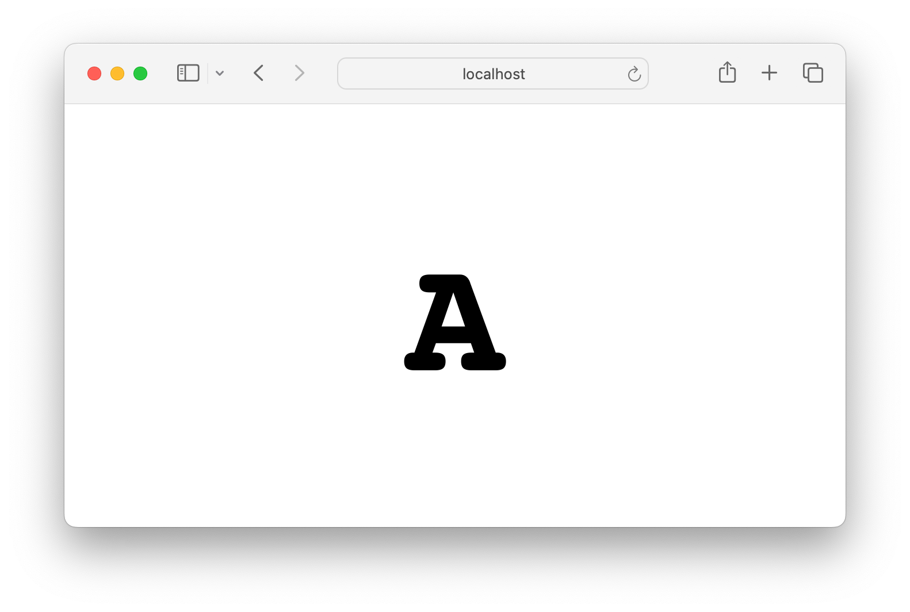
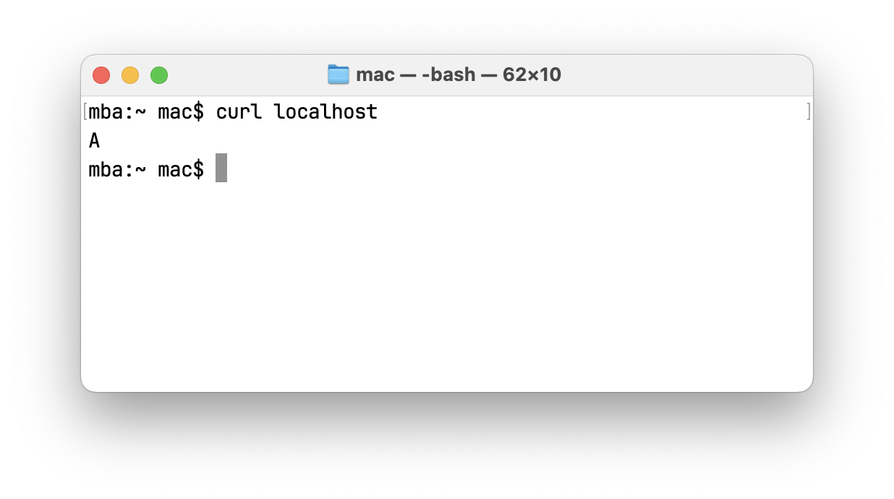

# docker hello world web server examples

Two micro images with hello world web servers



Content negotioation works following way - for browser you will see huge letter as on screenshot above, for everything else - plain text response like in screenshot below



**Usage**

```bash
docker run -it --rm -p 80:80 ghcr.io/mac2000/a

open localhost
curl localhost
```

**Why**

This images are ment to be used for examples where you want to demonstrate how load balancing works, or if you want to demonstrate how nginx upstream configuration works etc

**How**

Technically you do not even need this images

You may have the same by doing

```bash
docker run -it --rm -p 80:80 -v "$PWD/a/default.conf:/etc/nginx/conf.d/default.conf" nginx
```

```
server {
  listen       80;
  server_name  localhost;

  location / {
    if ($http_accept ~* "text/html") {
      add_header Content-Type text/html;
      return 200 "<style>html, body { padding: 0; margin: 0; width: 100vw; height: 100vh; overflow: hidden; display: flex; align-items: center; justify-content: center; font: normal 72px/1 monospace; }</style><H1>A</H1>";
    }

    return 200 "A\n";
  }
}
```

Images are built only for simplicity
